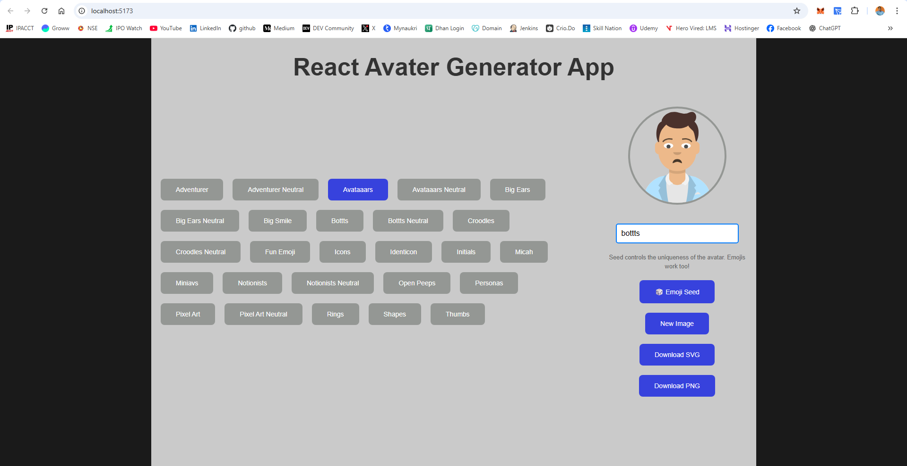
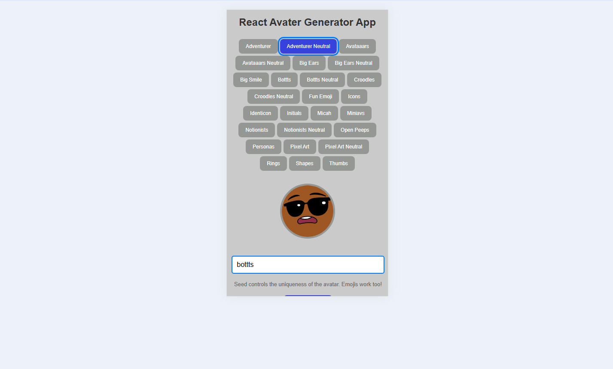

# 🧑‍🎨 React Avatar Generator (Dicebear API)

A modern React application to generate customizable avatars using the [DiceBear Avatar API v7](https://www.dicebear.com/), with live preview, custom styles, emoji-based seeds, and download support in SVG & PNG.

---

## ✨ Features

- 🎨 Choose from multiple avatar styles (bottts, avataaars, pixel-art, etc.)
- 🔁 Generate avatars randomly or with emoji-based seeds
- 🎯 Live preview with fade-in animation
- 🧪 Seed input with validation and debounce
- 📦 Download avatars as **SVG** or **PNG**
- 📱 Responsive & mobile-friendly layout
- ♿ Accessible with `aria-*` and keyboard support
- ⏳ Loader spinner during image generation

---

## 🖼️ Demo

> Live App: [https://react-avatar-generator-app.vercel.app/](https://react-avatar-generator-app.vercel.app/)



> Desktop View



> Mobile View

---

## 🚀 Getting Started

### 1. Clone the Repository

```bash
git clone https://github.com/surendergupta/react-avatar-generator-app.git
cd react-avatar-generator-app
```

### 2. Install Dependencies

```bash
npm install
```

### 3. Run the App

```bash
npm run dev

```
Now open http://localhost:5173 in your browser.

---

## 🧰 Tech Stack
- ⚛️ React (Hooks, Functional Components)
- 🎨 DiceBear Avatars API (v7)
- 💅 Custom CSS styling
- 🔁 `useMemo`, `useEffect`, `setTimeout`, and debounce logic
= 🌀 react-spinners for loader

---

## 📁 Folder Structure
```css
src/
├── Components/
│   ├── Avatar/
│   │   ├── Avatar.jsx
│   │   └── Avatar.css
│   └── AvatarStyles/
│       └── AvatarStyles.jsx
├── App.jsx
├── App.css
├── main.jsx
└── index.css

```

---

## 📌 Future Enhancements
- 🌗 Dark mode toggle
- 🧠 Avatar history/save option
- 🎛️ More control options (e.g., eyes, hair, etc.)
- 🌍 Language support

---

## 📜 License
This project is open-source and available under the MIT License.

---

## 👨‍💻 Author
Made with ❤️ by [Surender Gupta](https://www.linkedin.com/in/surender-gupta/)